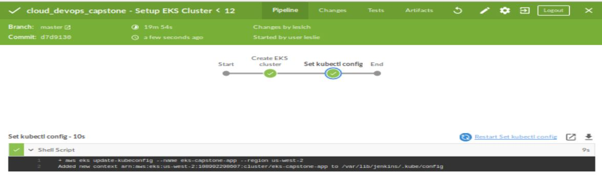

# Cloud DevOps Capstone Project

This project demonstrates the use of CI/CD to  productionalize a simple nginx web application, using tools such as Jenkins to automate continuous integration, build and application deployment to AWS Kubernetes as a Service (EKS) Cluster. 

Overall, the deployment process consists of few basic step/stages:-

a) **Initial Setup (run once):**
* create and configure a AWS EKS Cluster

b) **Deployment Setup:**
* basic linting (HTML & Dockerfile)
* building docker image
* pushing image to DockerHub registry, and
* deployed to EKS Cluster.

The deployment type used in this case is rolling update.

### Project Structure
The project itself is organized into 2 subdirectory, setup and deployment.

a) **setup directory:** 
* `Jenkinsfile` - jenkins pipeline that used initially to configure and create AWS EKS Cluster

b) **deployment directory:**
* `Jenkinsfile` - pipeline thar perform steps such as linting, container building and Kubernetes deployment
* `Dockerfile` - docker file for nginx application
* `index.html` - HTML source file for nginx application
* `deployment.yaml` - to create Kubernetes deployment object
* `service.yaml` - to create service for the deployment object

---

### Setup the Environment
Here is the requirement and setup required:-
* AWS IAM User (Access Key ID & Secret Access Key) with sufficient AWS EKS permission
* AWS CLI (Version 2), kubectl and eksctl utilities to manage AWS EKS cluster 
* Jenkins and it's plugins (e.g. CloudBees AWS Credential, AWS Step Pipeline, Blue Ocean etc)
* DockerHub account
* Create Jenkins credential to store AWS & DockerHub credential
* Configure AWS CLI with IAM User 

### Initial Run - EKS Cluster Steps

* Create and Configure Jenkins pipeline that fetch from this GitHub repo
* Run manually to build EKS Cluster

### Deployment Run - App Deployment Steps

* Create Jenkins pipeline that fetch from this GitHub repo
* Push changes (eg. index.html or Dockerfile) to GitHub to trigger pipeline execution

---
### Pipeline Process
- Initial Setup - Create EKS Cluster

    

- Deployment Setup - Linting stage failed

    

- Deployment Setup - Linting stage passed

    

- Deployment Setup - All Stage passed

    

- Deployment Setup - kubectl rollout status

    

- Deployment Setup - Application running in AWS

    

-
